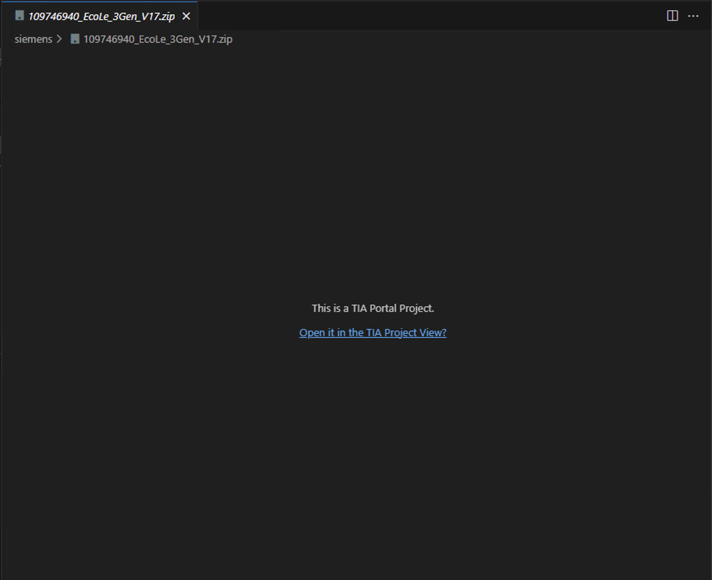
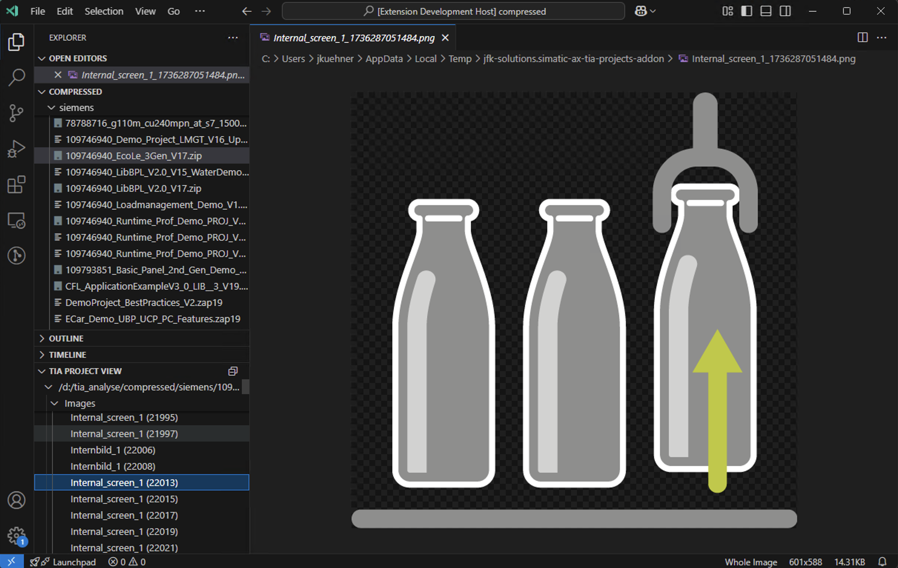
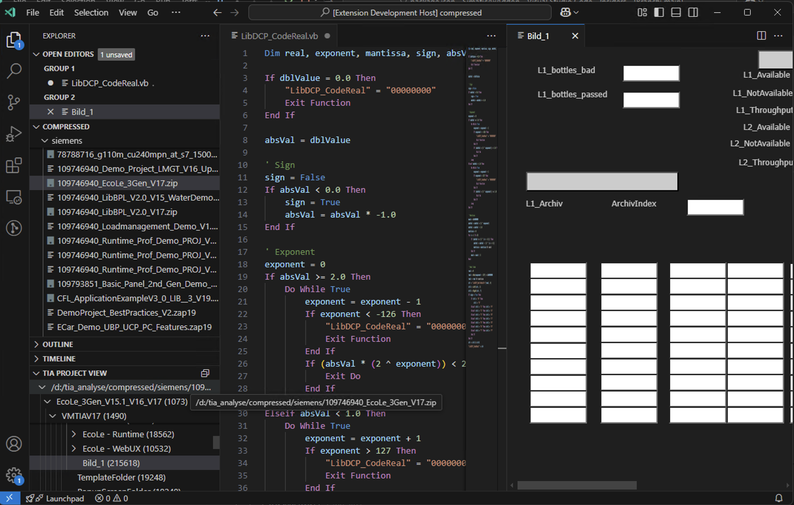

# simatic-ax-addon
A VSCode Addon to read TIA Portal Project files for use in Simatic-AX.

Also you can Online access a CPU with Firmware >= 2.9 and projected in TIA >= V17

## addon-page

https://marketplace.visualstudio.com/items?itemName=jfk-solutions.simatic-ax-tia-projects-addon

## prerequisites

- .NET 8 or greater (https://dotnet.microsoft.com/en-us/download/dotnet)

## how to use

- drag a file (TIA Project, Zipped Project) to the tree or right click and select "Open in TIA Project View"

## sample images

### Selecting a TIA project or archive

### A image stored in a TIA project

### A VB-script and a WinCC screen

## icons
icons from https://iconduck.com/sets/hugeicons-pro
